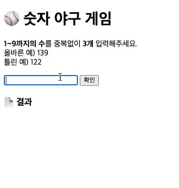

<p align="middle" >
  
</p>
<h1 align="middle">숫자 야구 게임</h1>

## 목적

- 우아한테크코스 프리코스를 진행하며 도움을 많이 받았다. 하지만 5기 프리코스부터는 프론트엔드 과정 미션이 콘솔에서만 진행되었다. 그래서 이번에는 dom을 공부하면서 바닐라 자바스크립트를 공부하고자 이전 기수들의 프리코스 문제들을 풀어보고자 한다.

## 숫자 야구게임 설명

기본적으로 1부터 9까지 서로 다른 수로 이루어진 3자리의 수를 맞추는 게임이다.

- 같은 수가 같은 자리에 있으면 `스트라이크`, 다른 자리에 있으면 `볼`, 같은 수가 전혀 없으면 `낫싱`이란 힌트를 얻고, 그 힌트를 이용해서 먼저 상대방(컴퓨터)의 수를 맞추면 승리한다.
  - 예) 상대방(컴퓨터)의 수가 425일 때
    - 123을 제시한 경우 : 1스트라이크
    - 456을 제시한 경우 : 1볼 1스트라이크
    - 789를 제시한 경우 : 낫싱
- 위 숫자 야구게임에서 상대방의 역할을 컴퓨터가 한다. 컴퓨터는 1에서 9까지 서로 다른 임의의 수 3개를 선택한다. 게임 플레이어는 컴퓨터가 생각하고 있는 3개의 숫자를 입력하고, 컴퓨터는 입력한 숫자에 대한 결과를 출력한다.
- 이 같은 과정을 반복해 컴퓨터가 선택한 3개의 숫자를 모두 맞히면 게임이 종료되고, 재시작 버튼이 노출된다.
- 게임이 종료된 후 재시작 버튼을 클릭해 게임을 다시 시작할 수 있다.
- 사용자가 잘못된 값을 입력한 경우 `alert`으로 에러 메시지를 보여주고, 다시 입력할 수 있게 한다.

<br>

### 💻 실행 결과



<br>

## 기능 목록

1. 숫자 입력 기능

   - [x] 숫자의 범위는 1부터 9사이의 숫자이다.
   - [x] 세자리 숫자를 입력한다.
   - [x] 세자리 숫자는 중복하지 않는 숫자이다.
   - [x] 세자리 숫자 이외의 입력값이 입력되면 재입력하라는 alert창을 띄운다.
   - [x] alert창을 닫으면 입력창이 초기화 된다.

2. 랜덤 숫자 세팅 기능

   - [x] 랜덤 숫자를 세팅한다.
   - [x] 게임 재시작이 되면 랜덤 숫자를 새롭게 세팅한다.

3. 숫자 비교 기능
   - [x] 같은 수가 같은 자리에 있으면 스트라이크를 출력한다.
   - [x] 같은 수가 다른 자리에 있으면 볼을 출력한다.
   - [x] 스트라이크와 볼이 같이 출력될 경우엔 볼을 먼저 쓰고, 스트라이크를 쓴다.
   - [x] 세자리 숫자가 모두 다른 자리에 있거나 일치하지 않는다면 낫싱을 출력한다.
   - [x] 세자리 숫자와 위치가 모두 일치한다면 정답을 맞췄다는 문구와 재시작여부를 묻는 문구를 출력한다.

## 폴더 구조

```
📦src
 ┣ 📂game    -------------------------------------- 숫자야구게임 로직에 필요한 파일을 모은 폴더
 ┃ ┣ 📜BaseballGameLogic.js   --------------------- 숫자야구게임 메인로직
 ┃ ┣ 📜NumberGenerator.js     --------------------- 랜덤 숫자 만드는 로직
 ┃ ┗ 📜Validator.js           --------------------- 입력값에 대한 유효성 검사
 ┣ 📂rendering
 ┃ ┗ 📜Render.js              --------------------- 렌더링 파일
 ┣ 📂utils
 ┃ ┗ 📜Dom.js                 --------------------- 공통적으로 사용되는 Dom 코드 파일
 ┗ 📜index.js                 --------------------- 게임 로직과 렌더 로직을 통합하는 파일
```
